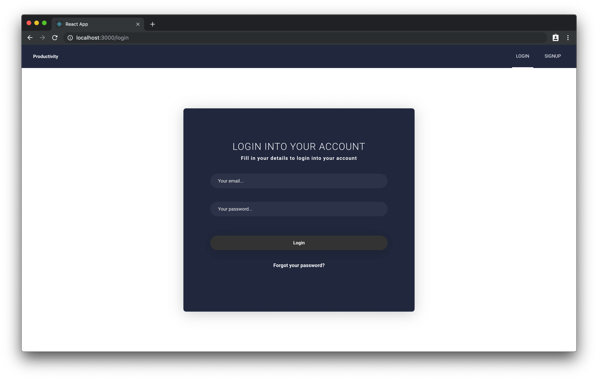
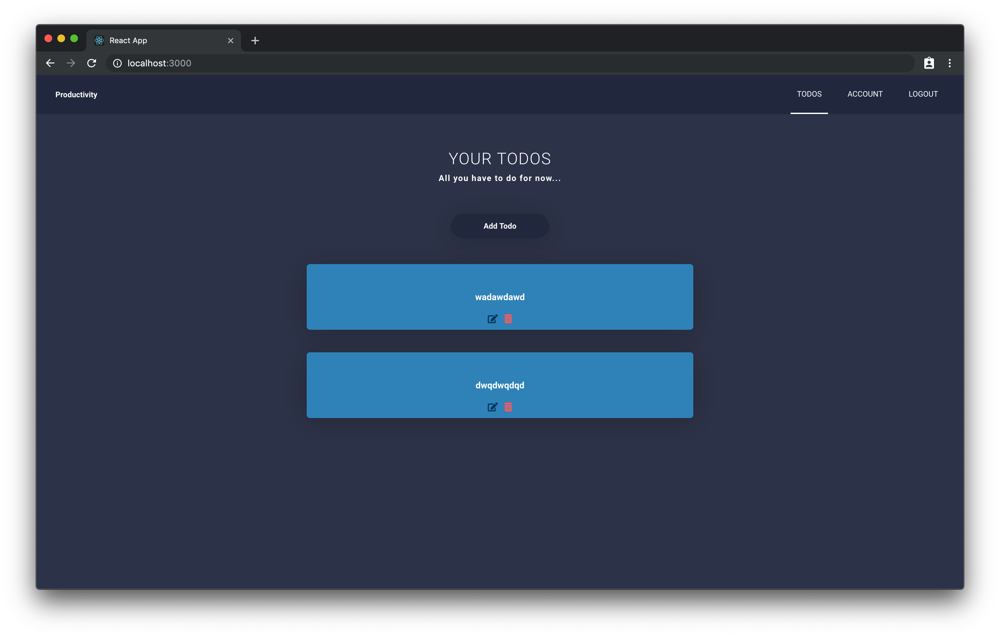
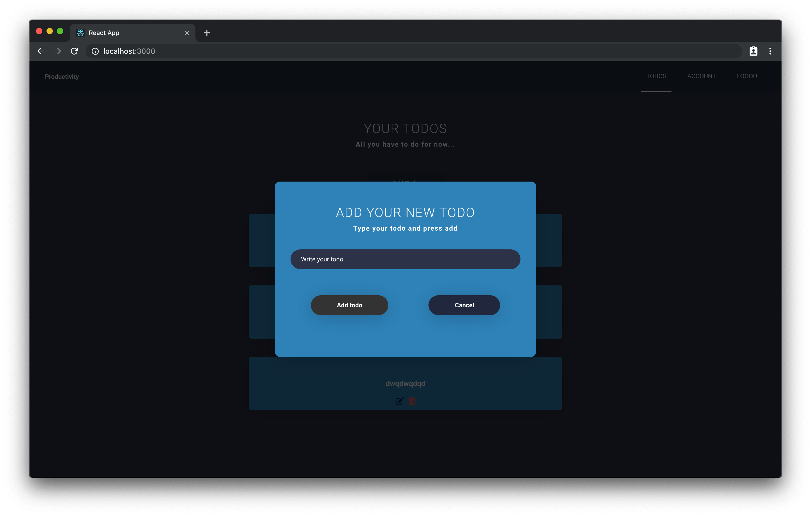

# Todo App w/ Auth
Enter your firebase app key information in /src/Firebase/firebase.js
in your firebase app create app with sign auth and create database with two columns first is firstName and second is lastName







### Installing

Clone the Repository and run

```
npm install
npm run dev
```

## Deployment

To deploy simply run

```
npm run build
```

